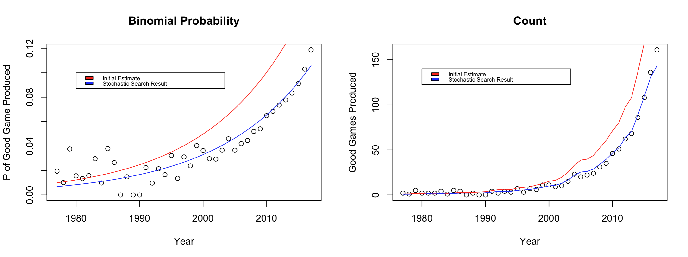

# board-game-analysis

Here is a quick summary of my work exploring Board Game Geek's data set.
For a more detailed report check out `final_report.pdf`!

## EDA

I found clear trends in both quantity and quality

## Modelling Quantity
I modeled the number of games produced each year as a Poisson with an underlying rate that changes over time as an exponential. Here it is the likelihood function for the data that I used in a stochastic search to fit the model.

$$\mathbb{P}(X_t=k_t|a, b) = \frac{e^{-exp(at+b)}exp(at+b)^{k_t}}{k_t!}$$

$$\mathbb{P}(X|a, b) = {\displaystyle \prod_{t=1}^{T} \mathbb{P}(X_t=k_t|a, b)}$$

$R^2$ value for the model was 0.983

## Modelling Quality

I modeled the shifting proportion of high scoring games over time as a binomial with an underlying probability that is changing over time. I modeled the changing probabilities / proportions using an exponential. Below is the likelihood function that was used to fit the model in a stochastic search.

$$\mathbb{P}(X_t=k_t|N, a, b) = {N\choose k_t} exp(at+b)^{k_t}(1-exp(at+b))^{N-k_t}$$

$$\mathbb{P}(X|N, a, b) = {\displaystyle \prod_{t=1}^{T} \mathbb{P}(X_t=k_t|N, a, b)}$$

$R^2$ value of 0.868 for modelling probabilities, and $R^2$ value was 0.991 for modeling number of good games produced each year

## Other Hypotheses

- Themes do tend to have significantly distinct ratings distributions. Warefare had the highest average score, and knowledge based games performed the worst
- Mechanics also had distinct distributions for ratings, and games with mechanics to discourage player interaction performed best
- Games that were funded by a Kickstarter campaign outperformed those which were not

