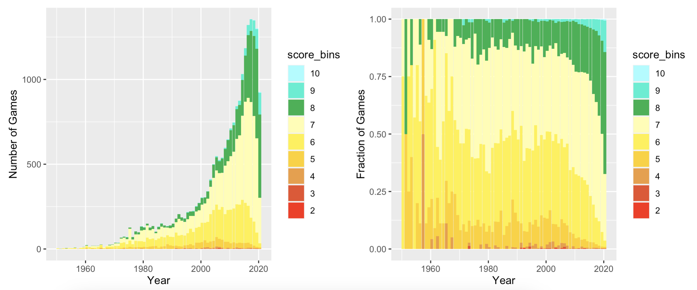
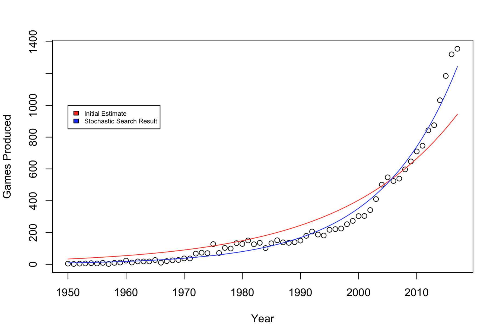
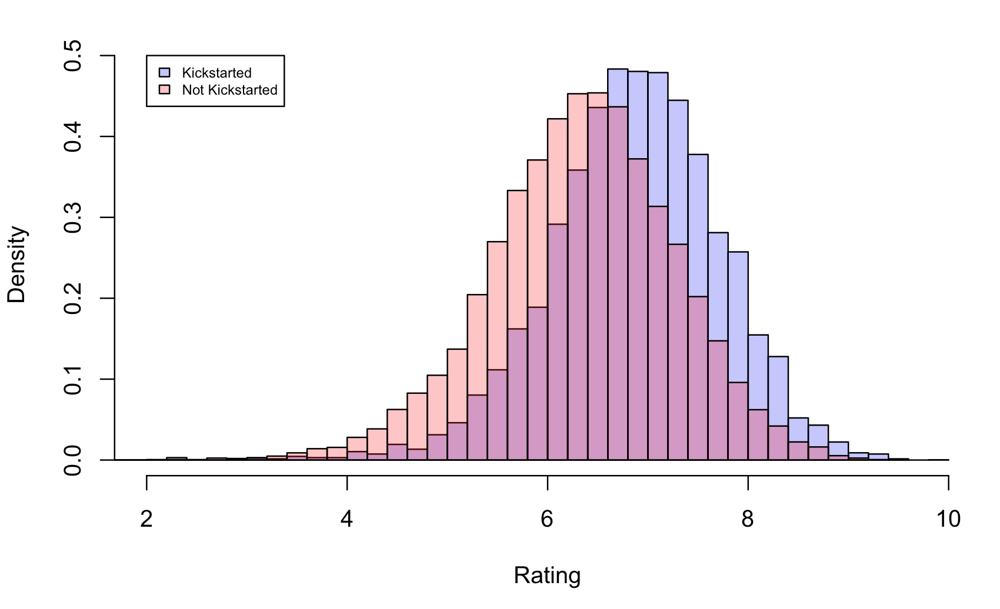
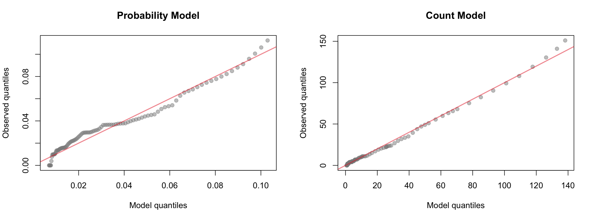

```{=tex}
\fontsize{12}{22}
\selectfont
```
```{r setup, include=FALSE}
knitr::opts_chunk$set(echo = TRUE)
```


## Data and Context

|         Boardgamegeek.com is a site where users rate, review, and discuss board games. The site has information on all sorts of game features like average review, year produced, best number of players, average playtime, and weight which is a measure of the game's complexity. This research uses data that was scraped from Board Game Geek using their API. The data set has 21,925 board games produced from 2021 all the way back to 3500 B.C. Anyone can contribute to the platform by leaving comments and reviews, and users can also add new games to the data set if they are not currently listed. It is important to note that the reviews for each game are entirely crowdsourced, so the average review is not a perfect measure of game quality. Different people like different kinds of features in a games, and quality here is fundamentally subjective. The ratings use a scale from one to ten, and while the website posts guidelines on how to interperet these numbers, reviewing a game as a six could mean different things to different users. Since users contribute to the site's data, there is also a slight lag as games are gradually added after the date they were released. The data set also has information on each games themes and mechanics. However, this information is also somewhat subjective. Judging whether the game involves 'alliances' can be tricky, and the data is pretty sparse in these areas where only one or two themes and mechanics are generally listed for each game.


## Exploratory Data Analysis
|         To start exploring the data, I made several pairs plots and histograms across the main variables associated with each game. These variables included year, average rating, weight, best number of players, number owned, age recommendation, and whether or not a game was kickstarted. I also plotted all of these variables against average score, as this was the primary variable of interest. Across all of these plots, there were no clear trends. Weight was the variable most correlated with average rating, but the roughly linear trend was noisy with a lot of unexplained variation. These initial plots also revealed significant information about the number of games produced in each year. The data set contained games that were released as early as 3500 B.C., and many games were given a default year of zero. For example, games like Go Fish do not have an exact year they were published, so these games appeared to be created at year zero. To avoid these games and extremely spread out data, I limited my analysis to games that were produced after 1950 and before 2017. I trimmed down the most current years as well because I observed a lag in reporting games on the site. Users are ultimately responsible for populating the website, and more recent API calls confirmed that the tailing off of production in recent years is due to a lag in reporting. Plotting the number of games produced each year exposed an exponential increase in game production in recent years. To dig in further, I broke down this histogram into a stacked bar chart where games were binned by their average rating. This revealed that game quality, as measured by user reviews, has also been increasing in recent years. 



|         Next, I looked into themes and mechanics to see if they had any effect on user reviews. For clarity, a theme here refers to a label such as animals, ancient, or World War II. Meanwhile, mechanics are functions that are included in the game like dice rolling, alliances, and auctions. I started by making correlation plots to check if there was any correlation between specific mechanics or themes and game reviews. The correlations were all extremely small due to the sparsity of the data. For these features, there was essentially a large matrix with zeros and ones to specify whether a game is associated with a theme or mechanic. Many games did not have any associated themes or mechanics, and most games only had one or two listed. With such infrequent data I aggregated themes into larger categories. For example fighting, World War II, and Civil War were added along with others to the warfare category. Similarly, dice rolling, push your luck, and random production would all be include in the randomness mechanic group. For more information on what these categories look like, the appendix contains word clouds where the size of each word is weighted by the number of games in that category. The distributions across themes and mechanics appeared to be very similar upon first inspection, but I explored this more with a hypothesis test later in this research.

|         Lastly, I looked at whether games that were funded on Kickstarter had higher average reviews from users. Histogramming the ratings for Kickstarter games and non-Kickstarter games highlighted a dramatic difference between the two populations which I explored more with a difference of means hypothesis test.

|         Going forward, I aimed to model board game quantity and quality over time. Then I investigated several hypothesis related to theme, mechanics, and the impact of Kickstarter campaigns.


## Modelling Quantity
|         I started by modeling the number of games produced each year as a Poisson with an underlying rate that changes over time. Modeling the rate as an exponential that changes by year resulted in a fit that captures the growth extremely well. The likelihood function is essentially the product between the probabilities of seeing each count of games in the data.

$$\mathbb{P}(X_t=k_t|a, b) = \frac{e^{-exp(at+b)}exp(at+b)^{k_t}}{k_t!}$$

$$\mathbb{P}(X|a, b) = {\displaystyle \prod_{t=1}^{T} \mathbb{P}(X_t=k_t|a, b)}$$

|         I used a stochastic search procedure to fit the model. This means that the algorithm randomly generates coefficients for the model then checks the the new likelihood of seeing the observed data with this model.  This is built on the likelihood equations above. I also bootstrapped the model to get the 99% confidence intervals for the coefficients. The search ran for 10,000 iterations, and it returned coefficients for the exponential where a = 0.074 [0.063, 0.075] and b = -142.42 [-144.73, -120.24]. Interestingly, the bootstrapped distributions for the coefficients were not normal. The search found three distinct local optima. This may imply that there is heterogeneity in the data or that the statistic is sensitive to different subsets within the data.

{width=60%}

|         Examining the residuals, the $R^2$ value for the model was 0.983. There is some underestimation in the last couple of years and in the mid 70's. While I could not find a definitive explanation, I found that Dungeons and Dragons was released in 1974, and this sparked a new wave of role playing games. Creating a QQ plot confirmed the model's excellent fit as the quantiles lined up in a linear fashion. The QQ plot also highlights some underestimation at the tail and wavering in the middle, but overall the fit is good.


## Modelling Quality

|         To model the shifting proportion of high scoring games over time, I chose to model the number of 'good' games each year as a binomial. Each year a number of games are produced, and this model construes this production as a series of coin flips. With a binary distinction in place, each game is either 'good' or 'bad,' and the underlying probability associated with this coin flip is changing each year. With this perspective, I first had to determine an appropriate cutoff for good games. To do this, I plotted all the reviews as a histogram and modeled it with a normal distribution. Then, I used the qnorm function to determine which games were in the top 10% of all games ever produced. This corresponded to a cut off score of 7.62. I also checked online forums and the comments on Board Game Geek itself. Most users agreed that good games were usually 7.5+, so this corresponds nicely with the calculated cut off.[^1] Although this is a rough estimation, Board Game Geek's documentation also puts forwards guidelines for scoring. Here an eight is a "very good game. I like to play. Probably I'll suggest it and will never turn down a game," and a seven is a "good game, [that I'm] usually willing to play."[^2] With these combined observations, I am confident that a score of 7.62 is a fair cutoff for a good game. For the changing probability of the binomial, I experimented with a couple of different models. I attempted using a linear, exponential, and quadratic distribution, and I observed the best fit using an exponential. Lastly, I trimmed down the range of years to look from years 1977 to 2017. I found that there were too little games in the years before 1977, and this is the first year where at least 100 total games were produced. Before 1977 most years had no good games, yet if there was a good game produced, it was possibly only one of four produced that year which resulted in dramatic outlier proportions. The likelihood function for this distribution is the product of the probabilities for seeing the count of good games in each year under the binomial.

$$\mathbb{P}(X_t=k_t|N, a, b) = {N\choose k_t} exp(at+b)^{k_t}(1-exp(at+b))^{N-k_t}$$

$$\mathbb{P}(X|N, a, b) = {\displaystyle \prod_{t=1}^{T} \mathbb{P}(X_t=k_t|N, a, b)}$$

|         Similar to the previous model, I used a stochastic search to fit the model, and I bootstrapped to find the confidence intervals for the coefficients. The search returned coefficients for the exponential corresponding with the probability where a = 0.068 [0.066, 0.073] and b = -140.42 [-149.63, -135.03].


|         The model for the probabilities had an $R^2$ value of 0.868, and when modeling the overall counts, the $R^2$ value was 0.991. The model does well to fit the exponential changes in the proportion of good games. However when using the binomial and the total number of games produced, the fit is even better. The model is essentially combining changes in probability, and the increasing number of games produced to explain nearly all the variation in the data. The QQ plots for the model also show that while there is some wavering around the target line for the probabilities, the model for total counts is well fit.

## Hypotheses

|         First, I wanted to evaluate whether the themes associated with each game have any impact on their average rating. As I mentioned earlier in my exploratory data analysis, I aggregated the themes into eight larger categories. These larger themes were warfare, historical, sci-fi and fantasy, knowledge based, adventure and exploration, nature and animals, building and economics, and culture based games. I used the difference of means as a test statistic, and I calculated p values for the null distribution. In other words, I calculated the probability of seeing such a difference in means if the two sets of games were drawn from the same distribution. Calculating these p values pairwise across the eight different groups resulted in a matrix of p values that I have attached in the appendix. This test showed that most theme groups were actually significantly distinct. Out of all of the comparisons adventure and exploration was most similar to the building and economics group. This makes sense considering the popularity of colonial style board games. The adventure and exploration group was also similar to the sci-fi and fantasy group as space exploration is a common theme that combines both genres. Warfare games did the best on average, and knowledge based games did the worst though the difference in average score only differed by 0.6. While I am tempted to conclude that trivia and math pale in comparison to conquering and bloodlust, more work is needed to tease out an explanation for the differences in these distributions.

|         With a similar approach, I tested whether certain mechanics were more likely to be associated with higher scoring games. The data for mechanics was also very sparse, so I grouped mechanics into nine larger categories: resource management, territory control, randomness, cooperation, noncooperation, player interaction, non interaction, building, and secret elements. These groups reflect the most common elements shared across the mechanics in the data, but I also wanted to look at areas I thought would have the most impact. For example, do people like playing with randomness and chance, or is it frustrating? With so much digital media, board games have seen a recent resurgence. Is this due to the interactions between players that are built in to this activity? To test these questions, I used the difference of means once again to calculate p values pairwise across the nine groups. The results showed that nearly all of these distributions were significantly unique from one another. The only pair that was similar was cooperative and non cooperative games. I found it really surprising that of all the group pairings, stealing, killing, and backstabbing were essentially no different from alliances, trading, and teamwork. Another surprising result was that games with mechanics that discourage player interaction had the best scores on average while mechanics that encouraged it performed the worst. This directly contradicts what I expected to find in this hypothesis test. For anti-interaction games, solo and solitaire games were the largest contributor, and in my limited experience I have only seen optional solo variants for games that are relatively complex. Games like Wingspan and Terraforming Mars both have very high reviews (8.1 and 8.4 respectively) and are generally played with a group, but they do offer rule variants to play by yourself. Perhaps this added feature is a sign of thoughtful design where creators go above and beyond was is normally expected to come with a board game. Another possibility is that this result is reflective of the users who use Board Game Geek in the first place. The demographic using the site are people who are the most passionate about these games, and maybe they value solo options when it is not possible to get a full group together.

|         Lastly, I separated games based on whether they were funded on Kickstarter. These two populations were significantly distinct, disproving the null hypothesis. Kickstarter games had much higher ratings on average. This makes sense given that creators on this platform are able to cater towards a select group of dedicated players. With this design approach, games only succeed if they are backed by a community of excited players, and these supporters are likely the same people leaving reviews for the game down the road. 



## Going forward

|         From this analysis, it is clear that the quantity and quality of board games being produced has increased exponentially over the past 40 years. While there is some variation in the residuals, the $R^2$ values and QQ plots confirm that the models are generally well fit. While significant progress has been made towards modelling changes in board game production and quality over time, it also raises many questions for further research. First, the local optima in the bootstrap for the quantity model hints that there may be more structure to the underlying data which has yet to be explored. For a topic where quality is so subjective, there many more opportunities to explore features such as themes and mechanics. This paper provides some initial analysis, but there is room to develop more thorough models and explanations. For example, one could develop a machine learning regression model to incorporate all of these different features. Then one could use something like a permutation test to evaluate the importance of each feature. Additionally, one could look at how these themes and mechanics have changed over time. This analysis was focused on the distribution of ratings, but there are no doubt shifts in these features over time. While this data set did not include this information, it would also be interesting to look at the locations where each game was created. Further investigations into the underlying structure of the data and the impact of various game features hold promise for deeper insights into the ever-evolving board game industry. 

## Appendix

(in order mentioned)

{width=60%}


{width=60%}

{width=60%}



{width=60%}

{width=60%}


